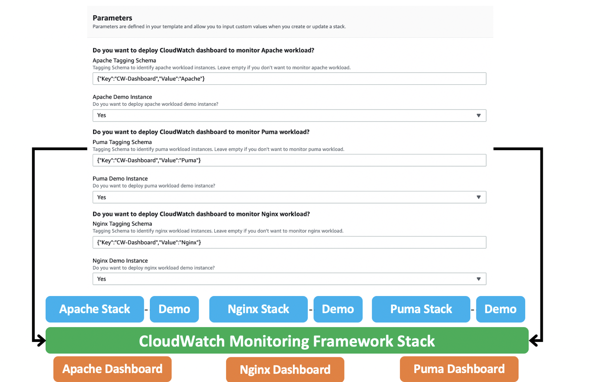
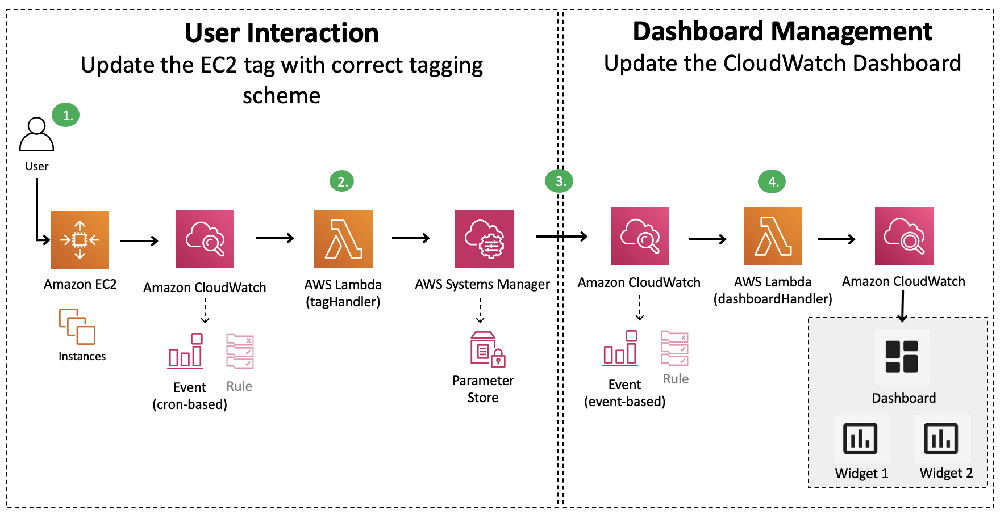

# Amazon CloudWatch Monitoring Framework

**[🚀Solution Landing Page](https://aws.amazon.com/solutions/implementations/amazon-cloudwatch-monitoring-framework)** | **[🚧Feature request](https://github.com/awslabs/amazon-cloudwatch-monitoring-framework/issues/new?assignees=&labels=feature-request%2C+enhancement&template=feature_request.md&title=)** | **[🐛Bug Report](https://github.com/awslabs/amazon-cloudwatch-monitoring-framework/issues/new?assignees=&labels=bug%2C+triage&template=bug_report.md&title=)** | **[📜Documentation Improvement](https://github.com/awslabs/amazon-cloudwatch-monitoring-framework/issues/new?assignees=&labels=document-update&template=documentation_improvements.md&title=)**

_Note: For any relevant information outside the scope of this readme, please refer to the solution landing page and implementation guide._

## Table of content

- [Solution Overview](#solution-overview)
- [Architecture](#architecture)
- [Installation](#installing-pre-packaged-solution-template)
  - [Parameters](#parameters-for-framework-template)
- [Customization](#customization)
  - [Setup](#setup)
  - [Changes](#changes)
  - [Unit Test](#unit-test)
  - [Build](#build)
  - [Deploy](#deploy)
  - [Example Scenario: Custom Metrics](#custom-metrics)
- [Supported CloudWatch Widgets](#supported-cloudwatch-widgets)
- [Configuring Instances](#configuring-ec2-instances)
- [Adding Workloads](#adding-workloads)
- [File Structure](#file-structure)
- [License](#license)

## Solution Overview

Amazon CloudWatch Monitoring Framework is intended for customers looking to easily gain actionable insight into their EC2 workloads. The process to configure cloudwatch agent, identify the right metrics, logs and create dashboard to see workload performance can be tedious and time-consuming.

The solution automates the process of dashboard setup and provides reference config files for some of the most common workloads. Using a tagging mechanism you can identify the instances you want to be monitored on the dashboard. The solution makes it easy for the customers to focus on workload KPIs rather than spending time on setting up the needed dashboards.

## Architecture

The solution follows nested stack approach for deployment of workload stacks. The workload stacks can be deployed individually as well.



The architecture can be broken into two components. **User Interaction** and **Dashboard Management**. The workflow is as follows:

- User puts tag on the EC2 instance
- _tagHandler_ lambda function fetches instances with the tag and updates SSM Parameter Store
- CloudWatch Events rule gets triggered when SSM parameter is updated, and invokes _dashboardHandler_ lambda function
- _dashboardHandler_ lambda function reads the SSM parameter and updates the CloudWatch dashboard widgets



## Installing pre-packaged solution template

- If you want to deploy the framework and related resources: [CW-Monitoring-Framework.template](https://solutions-reference.s3.amazonaws.com/amazon-cloudwatch-monitoring-framework/latest/amazon-cloudwatch-monitoring-framework.template)

- If you want to create resources to monitor Apache workload : [Apache.template](https://solutions-reference.s3.amazonaws.com/amazon-cloudwatch-monitoring-framework/latest/apache.template)

- If you want to create apache demo resources: [Demo.template](https://solutions-reference.s3.amazonaws.com/amazon-cloudwatch-monitoring-framework/latest/apache-demo.template)

#### Parameters for framework template

Parameters control individual workload related resource provisioning

**Apache Workload**

- **Deploy:** Do you want to monitor Apache workload?
- **Apache Schema:** Tag schema to identify apache workload instances
- **Apache Demo:** Do you want to deploy Apache demo instance?

## Customization

- Prerequisite: Node.js>10

### Setup

Clone the repository and run the following commands to install dependencies, format and lint as per the project standards

```
npm i
npm run prettier-format
npm run lint
```

### Changes

You may make any needed change as per your requirement. If you want to change the widgets and metrics for apache workload, you can modify the [apache exports](./source/services/dashboardHandler/lib/apache/apache_exports.ts).

Additionally, you can customize the code and add any extensibility to the solution. Please review our [feature request guidelines](./.github/ISSUE_TEMPLATE/feature_request.md), if you want to submit a PR.

### Unit Test

You can run unit tests with the following command from the root of the project

```
npm run test
```

### Build

You can build lambda binaries with the following command from the root of the project

```
npm run build
```

### Deploy

Run the following command from the root of the project

```
cd source/resources
npm i
```

The solution has 3 CDK Stacks

- Framework Stack: this stack deploys all the framework related resources and deploys individual workload related resources.
- Apache Stack: this stack deploys resources to monitor Apache workload and put logs & metrics on the dashboard
- Apache Demo Stack: this stack creates a single instance to showcase solution capabilities in monitoring Apache workload

```
cdk bootstrap --profile <PROFILE_NAME>
cdk synth CW-Monitoring-Framework-Stack
cdk deploy CW-Monitoring-Framework-Stack --profile <PROFILE_NAME>
```

- To deploy only Apache workload stack

```
cdk deploy CW-Monitoring-Framework-Stack --parameters ApacheWorkload=Yes
```

- To deploy demo stack to provision EC2 resources for demo purposes

Before deploying the demo stack, make sure to update the **Map** section in the template. The URLs should be pointing to reference configuration files in your S3 bucket. You may upload [config files](./source/resources/lib/apache/apache.config) to preferred S3 bucket in your AWS account.

```
cdk deploy CW-Monitoring-Framework-Stack --parameters ApacheDemoInstance=Yes
```

- To destroy deployed stack

```
cdk destroy CW-Monitoring-Framework-Stack --profile <PROFILE_NAME>
```

_Note: For PROFILE_NAME, substitute the name of an AWS CLI profile that contains appropriate credentials for deploying in your preferred region._

## Custom Metrics

Please follow this section to customize default set of metrics monitored by the solution for the workload. Let's say we want to add **cpu_usage details** for **amazon-cloudwatch-agent** on the apache dashboard. (_We assume that CloudWatch agent on your EC2 instance is sending these metrics to CloudWatch._) In this case you would need to update the [apache_exports.ts](./source/services/dashboardHandler/lib/apache/apache_exports.ts).

Since this would be a multi-dimensional metric, we need to update the _metricWidget_ in [apache_exports.ts](./source/services/dashboardHandler/lib/apache/apache_exports.ts) as follows:

```
[
  [
    "CWAgent",
    "procstat_cpu_usage",
    "exe",
    "httpd",
    "InstanceId",
    "%%instance%%",
    "process_name",
    "httpd",
  ],
  [
    "CWAgent",
    "procstat_cpu_usage",
    "exe",
    "amazon-cloudwatch-agent",
    "InstanceId",
    "%%instance%%",
    "process_name",
    "amazon-cloudwatch-agent",
  ]
]
```

To read more about supported widgets and metrics types, refer to [Supported CloudWatch Widgets](#supported-cloudwatch-widgets)

Now, we need to rebuild the microservice _dashboardHandler_:

```
cd source/services/dashboardHandler
npm run build:all
```

Follow the steps from [Build](#build) and [Deploy](#deploy) to deploy the updated apache dashboard.

## Supported CloudWatch Widgets

The framework currently supports following widget types

- Log widgets: to capture cloudwatch log insights queries
- Metric explorer widget: to capture metrics with single dimension
- Metric widget: to capture metrics with more than one dimension

_reference: [generics.ts](./source/services/dashboardHandler/lib/generics.ts)_

## Configuring EC2 Instances

The solution does not configure your EC2 instances. You need to ensure that your instances our configured correctly and sending CloudWatch metrics and logs in the needed format. For eg. if you have apache workload instances, you should refer to following cloudwatch agent configuration files, the same files are used to bootstrap our demo instance.

- [base configuration file](./source/resources/lib/apache/apache.config/infra.json) - base infrastructure cloudwatch agent configuration
- [apache configuration file](./source/resources/lib/apache/apache.config/apache.json) - apache related cloudwatch agent configuration
- [httpd.conf](./source/resources/lib/apache/apache.config/httpd.conf) - apache web server config for error and access log format

_Note: If the instances do not send needed metrics and logs to CloudWatch in needed format, the dashboard will not show data points from those instances._

## Adding Workloads

Currently, the framework supports apache workload, but we will continue to add more workloads. Each workload will have its own infrastructure resources needed to support it. This will remove any infrastructure dependency between workloads, and also allows to easily turn on/off individual workloads. However, the underlying services like _dashboardHandler_ will be shared between the workloads.

We have added placeholder for nginx workload, so let's take a look at steps to extend the framework to support nginx workload:

### Infrastructure

This is placeholder for nginx related infrastructure resources

#### /source/resources/lib/nginx

- [nginx.config](./source/resources/lib/nginx/nginx.config): Reference configuration files for the cloudwatch agent. The configuration files will determine the metrics and logs being pushed to Amazon CloudWatch. _reference: [apache.config](./source/resources/lib/apache/apache.config)_
- [nginx.infra.ts](./source/resources/lib/nginx/nginx.infra.ts): Infrastructure to support nginx workload. The infrastructure would be identical to [apache.infra.ts](./source/resources/lib/apache/apache.infra.ts). However, certain variables would differ, for eg. **WORKLOAD** env variable to **DashboardHandler** lambda.
- [nginx.demo.ts](./source/resources/lib/nginx/nginx.demo.ts): Demo instance to create sample nginx web server, bootstrapped with reference nginx configurations files. _reference: [apache.demo.ts](./source/resources/lib/apache/apache.demo.ts)_

#### /source/resources/framework.infra.ts

- [framework.infra.ts](./source/resources/lib/framework.infra.ts) Update the framework stack, **parameters** and **resources** section to deploy nested stack for new workload

### Services

We need to extend _dashboardHandler_ lambda function for new workloads

#### /source/services/dashboardHandler/lib/nginx

- [nginx_exports.ts](./source/services/dashboardHandler/lib/nginx/nginx_exports.ts): Manifest file for Log Widget, Metric Explorer Widget and Metric Widget configuration. You can specify the metrics, logs and widgets that you would like to show up on the dashboard for nginx workload. Please also see [Supported CloudWatch Widgets](#supported-cloudwatch-widgets) section. _reference: [apache_exports.ts](./source/services/dashboardHandler/lib/apache/apache_exports.ts)_
- [NginxHelper.ts](./source/services/dashboardHandler/lib/nginx/NginxHelper.ts) - Nginx helper class that extends our **CloudWatchHelper** abstract class. Implement the _widgets_ method to return Array of supported CloudWatch widgets. _reference: [ApacheHelper](./source/services/dashboardHandler/lib/apache/ApacheHelper.ts)_

#### /source/services/dashboardHandler/index.ts

- [index.ts](./source/services/dashboardHandler/index.ts): Update the entry point of the service to deploy nginx workload based on environment variable:

```
if (process.env.WORKLOAD === "Nginx") {
    const nginx = new Nginx();
    await nginx.putDashboard(
      process.env.START_TIME!,
      process.env.DASHBOARD_NAME!
    );
  }
```

## File structure

Amazon CloudWatch Monitoring Framework solution consists of:

- cdk constructs to generate needed resources
- tagHandler to validate tag, identify EC2 resources with the tag and update SSM parameter with instance-ids
- dashboardHandler to update dashboard for the workload with metrics and logs

<pre>
|-deployment/
  |build-scripts/                 [ build scripts ]
|-source/
  |-resources  
    |-bin/
      |-cw-monitoring-framework.ts     [ entry point for CDK app ]
    |-__tests__/                       [ unit tests for CDK constructs ] 
    |-lib/
      |-apache                         [ apache artifacts ]
        |-apache.config                [ apache configs ]
        |-apache_exports.ts            [ manifest file for apache resources ]
        |-apache.demo.ts               [ apache demo CDK construct ]
        |-apache.infra.ts              [ apache infrastructure CDK construct ]
      |-nginx                          [ placeholder for nginx artifacts ]
      |-framework.infra.ts             [ CDK construct framework resources ]  
      |-exports                        [ manifest file for framework resources ]
    |-config_files                     [ tsconfig, jest.config.js, package.json etc. ]
  |-services/
    |-helper/                          [ lambda backed helper custom resource to help with solution launch/update/delete ]
    |-dashboardHandler/                [ microservice to handle dashboard update ]
      |-__tests/                       [ unit tests for dashboard handler ]   
      |-lib/
        |-apache                       [ apache related modules ]
          |-apache_exports.ts          [ dashboard manifest for apache workload ]
          |-ApacheHelper.ts            [ class for apache workloads ]
        |-nginx                        [ placeholder for nginx workloads ]
          |-nginx_exports.ts           [ dashboard manifest for nginx workload ]
          |-NginxHelper.ts             [ class for nginx workloads ]
        |-CWHelperAbstract.ts          [ abstract class for workloads ]
        |-SSMHelper.ts                 [ class for SSM parameter store operations ]
        |-generics.ts                  [ generic interfaces for the application ]
        |-policyManager.ts             [ entry point to process FMS policies]
      |-index.ts                       [ entry point for lambda function]     
      |-config_files                   [ tsconfig, jest.config.js, package.json etc. ]
    |-tagHandler
      |-__tests/                       [ unit tests for tag handler ] 
      |-lib/ 
        |-EC2Helper.ts                 [ class for EC2 tag operations ]
        |-SSMHelper.ts                 [ class for SSM parameter store operations ]
      |-index.ts                       [ entry point for lambda function]     
      |-config_files                   [ tsconfig, jest.config.js, package.json etc. ]   
  |-config_files                  [ eslint, prettier, tsconfig, jest.config.js, package.json etc. ]  
</pre>

## License

See license [here](./LICENSE.txt)
